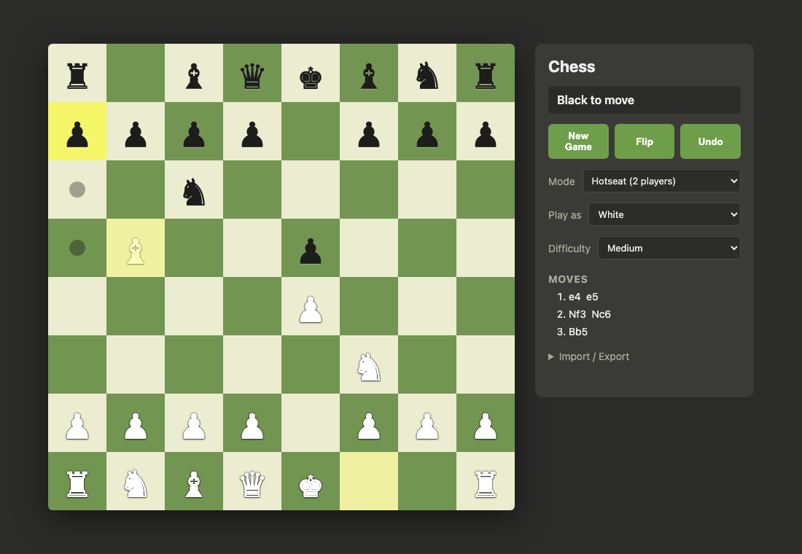

# Chess

A chess game with a Rust engine compiled to WebAssembly and a TypeScript
frontend. Play locally in **hotseat** (two players) or **against the computer**.



## Highlights

- **Bitboard engine** with magic-bitboard sliding-piece attacks, perft-verified
  move generation, full rules (castling, en passant, promotion, all draw
  conditions), SAN, and FEN/PGN import-export.
- **Alpha-beta search**: negamax with iterative deepening, a Zobrist-keyed
  transposition table, quiescence search, check extensions, and move ordering
  (TT move → MVV-LVA → killers → history). Difficulty maps to think-time.
- **Responsive UI**: the AI runs in a Web Worker (a second WASM instance) so the
  board never freezes; the main thread keeps a synchronous instance for instant
  legal-move highlighting.

## Architecture

```
engine/   Pure-Rust core (no wasm deps) — bitboards, movegen, search, eval,
          FEN/SAN/PGN, the Game façade. Natively unit-tested.
wasm/     wasm-bindgen wrapper exposing a Game class + search() function.
web/      Vanilla TypeScript + Vite. CSS-grid board, click-to-move, Web Worker.
```

The engine is deliberately free of WASM/JS dependencies so it compiles fast,
tests natively (perft, mate-finding, self-play), and could back a native UCI
binary later. See `docs/superpowers/specs/2026-06-09-chess-engine-design.md`.

## Prerequisites

- Rust (stable) + [`wasm-pack`](https://rustwasm.github.io/wasm-pack/)
- Node.js 18+

## Run

```bash
cd web
npm install
npm run dev        # builds the wasm package, then starts Vite
```

Open the printed URL. `npm run dev` rebuilds the WASM package (optimized) before
serving; use **Mode → Vs Computer** to play the engine.

## Test

```bash
# Engine: perft, rules/SAN/PGN, eval symmetry, mate-finding, self-play
cargo test --release

# WASM bindings smoke test (Node)
wasm-pack build wasm --target nodejs --out-dir pkg-node
node wasm/smoke.cjs

# Browser end-to-end (Playwright): hotseat + worker-backed AI
cd web && npm run e2e
```

## Engine internals

- **Board**: 12 piece bitboards + a mailbox, incremental Zobrist hash.
- **Move gen**: pseudo-legal generation filtered by make/unmake + king-safety.
  Verified by perft on the standard positions (startpos, Kiwipete, CPW 3–6).
- **Eval**: material + piece-square tables, king table tapered between
  middlegame/endgame by remaining material, bishop pair. Side-to-move relative.
- **Search timing**: injected via a `now_ms` closure so the engine stays
  `wasm32`-compatible (it uses `js_sys::Date::now()` in the worker, the system
  clock natively).

## MVP scope

In: hotseat, vs-computer, SAN move list, legal-move highlighting, FEN/PGN I/O.
Out (deferred): online play, undo/redo polish, drag-and-drop, opening book,
endgame tablebases, NNUE eval, multi-threaded search, move animations, sound.
